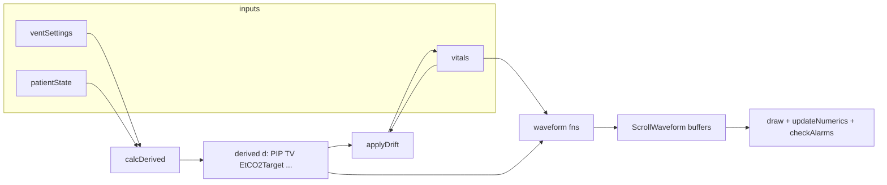

# Simulation engine context (`js/ventilator.js`)

This document describes how the **interactive workstation** ties together **ventilator mechanics**, **patient physiology**, **vitals monitors**, and **BIS / EEG display** in a single browser-side engine. All of this lives in one IIFE in `js/ventilator.js` (plus HTML/CSS for layout and separate tutorial scripts for modals).

## High-level architecture

The engine runs a **`requestAnimationFrame` loop** (`tick`) that advances **simulated time** (`simTime`), then each frame:

1. **Derives breath mechanics** from `patientState` + `ventSettings` → `calcDerived()` → pressures, flows, volumes, EtCO₂ target, auto-PEEP, etc.
2. **Applies slow physiology & cross-links** → `applyDrift()` (smoothed monitors, SpO₂, BP effect of mean airway pressure, scenario overlays, random drift).
3. **Feeds waveform buffers** — each monitor canvas uses a `ScrollWaveform` that samples pure functions like `genECG(t)`, `genABP(t)`, `genETCO2(t, d)`, vent waves from `genPressure/Flow/Volume(t, d)`, and `genEEG(t)`.
4. **Draws** all canvases, **BIS spectral heatmap**, P–V loop, then **updates DOM numerics** and **alarms**.

---

## Core state objects (hard-coded defaults + scenario overrides)

### `patientState`

Lung and circulation parameters used by the ventilator math and some vitals cross-links:

| Field | Role |
|--------|------|
| `compliance` (mL/cmH₂O) | VC/P-CMV tidal volume & τ (time constant) |
| `resistance` (cmH₂O/L/s) | Peak pressure, exp flow decay, **EtCO₂ “resist bonus”**, **SpO₂ penalty** when high |
| `co2Prod` (mL/min) | Drives **alveolar EtCO₂ target** via VA |
| `leak` (0–1) | Reduces exhaled TV; **SpO₂** penalty |
| `cardiacOutput` (0–1 normalized) | Scales CO₂ delivery (**EtCO₂**), worsens **SpO₂** when low |

### `ventSettings`

User-controlled vent (also synced from sliders in the UI):

- `mode`: `'VC'` or `'PC'`
- `tv`, `pip` (PC delta-P), `rr`, `peep`, `fio2`, `ti`

These feed **only** `calcDerived()` and the ventilator waveforms / numerics — not the ECG/ABP morphology directly.

### `vitals`

Monitor-facing numbers that waveforms and alarms read:

| Field | Typical use |
|--------|-------------|
| `hr`, `sysBP`, `diaBP` | ECG period, ABP shape, MAP alarms |
| `spo2` | Pleth + desat alarms; drifted toward a **target** from FiO₂, R, leak, CO |
| `etco2Display` | **Smoothed** capnogram number; lags `calcDerived().etco2Target` |
| `temp`, `mac`, `eto2`, `sevo` | Gas strip (mostly static unless scenario/overlay changes them) |
| `bis` | **Raw target** BIS (0–100); small random walk each drift tick |
| `bisSmoothed` | **Displayed** BIS; 1st-order lag toward `bis` |
| `nibp` | Cuff numerics; periodically refreshed from `sysBP`/`diaBP` |

**Note:** On the BIS bezel, **SR** and **EMG** text in HTML are **not** driven by this engine today; only the **numeric BIS**, **EEG trace**, and **spectral heatmap** are computed in code.

---

## Ventilator logic (`calcDerived`)

**Purpose:** Approximate **one breath** mechanics and **gas exchange** for teaching.

- **VC:** TV fixed → inspiratory flow → plateau from compliance → PIP = plateau + R×flow.
- **PC:** ΔP and compliance/exponential fill → delivered TV and flow shape.
- **Derived outputs:** `tv_mL`, `tv_exhaled` (minus leak), `pip`, `plat`, `peakFlow`, breath period `bp`, `te`, `tau`, `mean_paw`, **`autoPEEP`** (truncation when expiratory time is short vs τ).
- **EtCO₂ target:** Proportional to **CO₂ production / alveolar ventilation**, scaled by a **cardiac output factor** and a capped **resistance** term. The **display** `vitals.etco2Display` is **not** replaced each frame — it **smooths** toward this target in `applyDrift`.

Ventilator **waveforms** (`genPressure`, `genFlow`, `genVolume`, `genETCO2`) all take the same `d` object from `calcDerived()` so **PIP, flow, volume, and capnogram phase** stay **phase-locked** to the simulated breath.

---

## Vitals logic (monitors + cross-links)

### Waveforms (hard-coded generators)

- **ECG / ABP / SpO₂ pleth:** Driven by **`vitals.hr`**, **`sysBP`/`diaBP`**, and light noise — **not** directly by the ventilator, except indirectly when scenarios/drift change vitals.
- **EtCO₂ trace:** Uses **`d.etco2`** (= `vitals.etco2Display` for shape scaling) and **`patientState.resistance`** to exaggerate **Phase III upslope** (“shark-fin”) when R is high.
- **Ventilator:** Uses **`d`** only.

### `applyDrift(simTime, d)` — where monitors “talk” to each other

Runs **every frame** (not only every 5 s):

- **EtCO₂ display:** `etco2Display` moves toward `d.etco2Target` with a small gain (~0.001) — **lagged capnography**.
- **SpO₂:** Target from FiO₂, high resistance, leak, low **cardiacOutput**; SpO₂ drifts toward that target.
- **BP:** **`mean_paw`** from the ventilator reduces **sys/dia** slightly when mean airway pressure is high (venous return teaching).
- **`applyOverlay()`:** If a **scenario choice** set `overlay.active`, `patientState` and `vitals` **lerp** toward `overlay.patient` / `overlay.vit` at `overlay.speed`.
- **`applyPassiveDeterior()`:** During an active scenario step, if the step defines **`passiveDeterior`**, vitals/patient **lerp** toward worsening targets until the student answers.

Roughly **every 5 s** of sim time, a **slow random walk** nudges HR, BP, temp, and **`vitals.bis`** (clamped ~30–65) for organic variation.

### Alarms (`checkAlarms`)

Uses **`d`** (vent) + **`vitals`** (including smoothed EtCO₂ and BIS). Examples: high PIP, low exhaled TV, auto-PEEP, high/low EtCO₂, hypotension, desaturation, tachycardia, **BIS > 70** (“Possible Awareness”).

---

## BIS logic (hard-coded, coupled to `vitals`)

### Numeric BIS

- **`vitals.bis`:** Slowly random-walking target (see drift).
- **`vitals.bisSmoothed`:** Each frame:  
  `bisSmoothed += (bis - bisSmoothed) * 0.003`  
  The **large BIS number** on screen uses **`bisSmoothed`**.

### EEG waveform (`genEEG`)

Defines **“depth”** as `1 - bisSmoothed/100`:

- **Deeper (higher depth):** More **slow** sinusoidal content (~2.5 Hz).
- **Lighter:** More **10 Hz** and **22 Hz** content.

So the **EEG trace visually reflects the smoothed BIS**, not ventilator settings directly.

### Spectral heatmap (`drawSpectral`)

Four vertical **pseudo-bands** (δ–β–like colors). Amplitudes are **functions of `depth` = 1 − BIS/100** plus a slow time shimmer. This is **stylistic**, not a real FFT — it **tracks BIS** so the strip moves with hypnotic depth.

### Scenario start

When a scenario provides **`initialVitals.bis`**, **`bisSmoothed`** is **set equal** to that initial BIS so the monitor doesn’t lag through a long ramp at scenario start.

---

## How the three areas interact (summary)

| From | To | Mechanism |
|------|-----|-----------|
| Ventilator settings + lungs | EtCO₂ target, PIP, TV, mean airway pressure | `calcDerived()` |
| Mean airway pressure | Blood pressure | Small negative drift on sys/dia when `mean_paw` high |
| Patient (CO, R, leak, CO₂ prod) | EtCO₂ target, SpO₂ target | In `calcDerived` + `applyDrift` |
| Vitals (HR, BP, SpO₂, EtCO₂ display) | Monitor waveforms & alarms | Generators + `checkAlarms` |
| Vitals.bis / bisSmoothed | EEG + spectral strip | `genEEG`, `drawSpectral` |
| Clinical scenarios | patientState, vitals, vent, overlay | `startScenario`, `applyEffects`, `applyPassiveDeterior`, `applyOverlay` |

**There is no direct wire from “ventilator mode” to “BIS”** in code: **BIS** is driven by **`vitals.bis`** state (scenario initial values, overlay targets on choices, and random drift). **Indirect links** are intentional teaching ones (e.g. **hemodynamics / EtCO₂** via **cardiac output** and **ventilation**).

---

## Clinical scenarios (engine integration)

- **`SCENARIOS`** array: each scenario has **`initialPatient`**, **`initialVitals`**, **`initialVent`**, and **`steps`** with multiple-choice **`effects`**.
- **`startScenario`** copies initial state into `patientState`, `vitals`, `ventSettings`, resets overlay, syncs sliders.
- **Correct/incorrect choices** call **`applyEffects`**: may set **`overlay.patient` / `overlay.vit`** (lerped) and **`vent`** (immediate). Vitals effects are often **deltas** from current values for BP/HR.
- **`restoreBaseline` / `endScenario`** reload **saved** pre-scenario snapshots.

This is the **only** structured narrative layer; free-play uses defaults plus user sliders and drift.

---

## Related files (not the core engine)

- **`js/monitor-tutorial.js`** — ECG/ABP/SpO₂/EtCO₂/BIS/spectral **tutorial modals**; self-contained presets and canvas animations; **does not** drive `ventilator.js` vitals.
- **`ventilator.html`** — Layout IDs for canvases and numerics the engine expects.

---

## Maintenance notes

- To change **how “tightly” BIS follows** its target, adjust the **`0.003`** smoothing gain or **`applyDrift`** BIS random-walk bounds.
- To change **EtCO₂ responsiveness** to ventilation, adjust **`etco2Target`** formula or the **`0.001`** smoothing gain on `etco2Display`.
- New **cross-links** (e.g. BIS vs MAC) would go in **`applyDrift`** or scenario **`effects`**, keeping **`calcDerived`** focused on **mechanical ventilation + gas exchange**.
